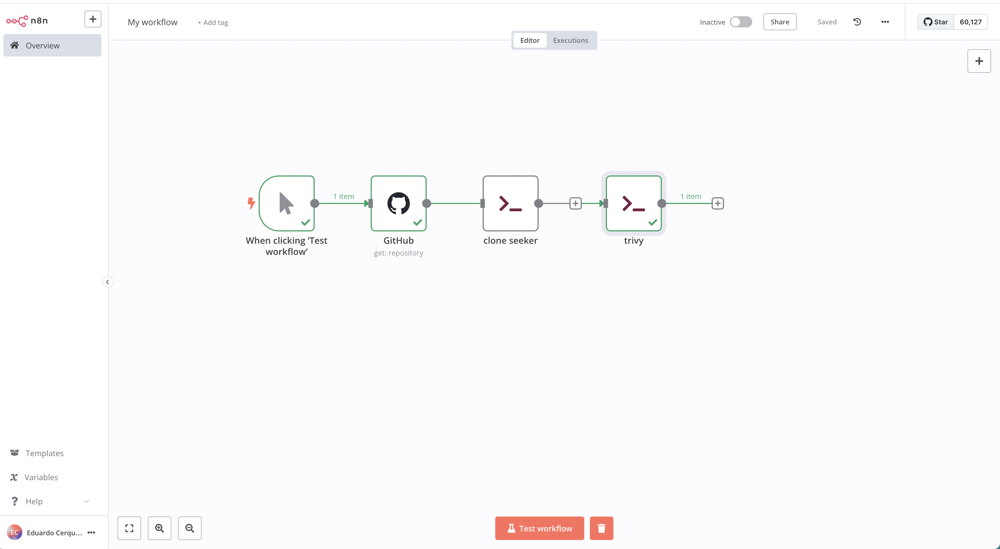

# n8n-testing

testing n8n workflow


```
docker build -t n8n-trivy .

docker volume create n8n_data
docker run -it --rm --name n8n-trivy -p 5678:5678 -v n8n_data:/home/node/.n8n n8n-trivy
```

http://localhost:5678/

Reference:
* https://docs.n8n.io
* https://docs.n8n.io/hosting/installation/docker/
* https://github.com/aquasecurity/trivy 


